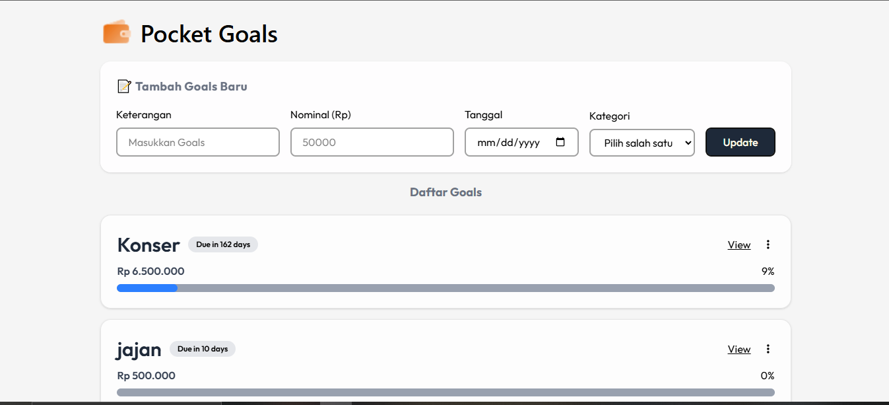

# 💰 Pocket Goals (Goals Finance Pockets)


Aplikasi berbasis web sederhana ala *M-Banking* untuk membantu pengguna mengelola target keuangan (*goals/bills*) dan memantau progres tabungan dengan mudah. Seluruh data disimpan dengan aman di dalam browser menggunakan *Local Storage*.

### 🌐 Live Demo: [Klik di Sini untuk Mencoba Aplikasi!]

https://pocket-goals.vercel.app/

## 📷 Preview



## 🚀 Features

- **Manajemen Goals:** Tambah, Edit, dan Hapus target tabungan (Goal/Bill).
- **Transaksi Tabungan:** Catat riwayat pemasukan uang (CRUD Transaction) ke dalam masing-masing target.
- **Visualisasi Progres:** Dilengkapi dengan *Progress Bar* dan kalkulasi persentase otomatis.
- **Tenggat Waktu (Due Date):** Pantau sisa hari menuju tenggat waktu targetmu.
- **Local Storage:** Data tidak akan hilang saat halaman di-refresh (tanpa perlu database/backend).
- **Responsive UI:** Tampilan modern bergaya *Glassmorphism/Soft Shadow* yang nyaman dilihat di desktop maupun mobile.

## 🛠 Tech Stack

- **Markup:** HTML5
- **Styling:** Tailwind CSS (Modern UI Design)
- **Logic:** Vanilla JavaScript (DOM Manipulation & Logic)
- **Storage:** Window Local Storage API

## 💡 Cara Penggunaan

1. Buka [Pocket Goals](https://pocket-goals.vercel.app/).
2. Di halaman utama, isi form target tabungan dengan melengkapi **Keterangan, Nominal Target, Tanggal Deadline, dan Kategori**.
3. Setelah form terisi, klik tombol **"Tambah"** untuk menyimpan target tabungan baru.
4. Setelah *Goal* terbuat, klik tombol **"View"** pada kartu (*card*) target tersebut.
5. Di halaman detail, isi nominal uang yang ingin ditabung lalu klik **"Tambah Tabungan"** (misal: keterangan "Sisa uang jajan minggu ini").
6. Progres tabungan akan otomatis bertambah dan warna *card* akan berubah menjadi hijau jika target sudah tercapai!
   
## 📂 Documentation

Dokumentasi lengkap proyek tersedia pada folder **`docs/`**, meliputi:
- 🎯 **Problem Statement:** Latar belakang masalah yang diselesaikan.
- 📌 **Project Scope:** Batasan dan ruang lingkup fitur aplikasi.
- 📄 **Functional Requirement Document (FRD):** Daftar kebutuhan fungsional sistem.
- 📊 **Use Case Diagram:** Interaksi antara pengguna dan sistem.
- 🌊 **Flowchart:** Alur logika sistem halaman per halaman.

## 📦 Installation & Setup (Untuk Developer)

Jika kamu ingin menjalankan atau memodifikasi proyek ini di komputer lokal:

1. **Clone repositori**
   ```bash
   git clone [[https://github.com/AmiliaKartika/pocket-goals.git]((https://github.com/AmiliaKartika/pocket-goals.git))]
