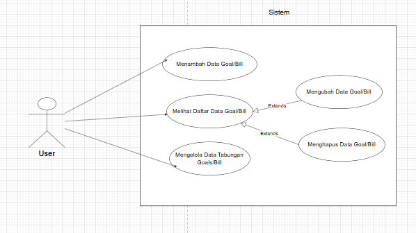

# 📊 Use Case Diagram

## Overview

Use Case Diagram menggambarkan interaksi antara pengguna
dengan sistem Pocket Goals.

## Diagram

## Main Use Cases

| Use Case | Description |
|---|---|
| Manage Goal/Bill | Membuat, melihat, mengubah, dan menghapus goal/bill. |
| View Goal Detail | Melihat informasi detail dan progres goal/bill. |
| Manage Savings | Menambah, mengedit, dan menghapus transaksi tabungan. |
| View Progress | Melihat jumlah dana terkumpul dan persentase progres. |
| View Deadline | Melihat deadline dan sisa waktu target. |

---

[← Functional Requirements](./03-functional-requirement-document.md) · [Flowchart →](./05-flowchart.md)
